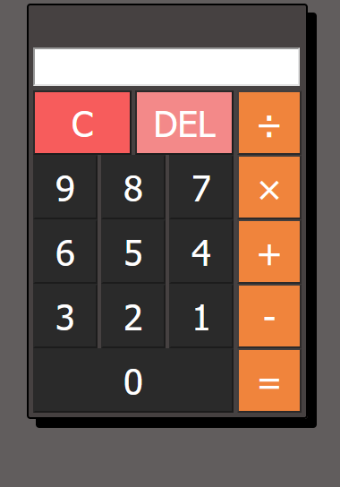

# Calculadora-HTML-CSS-JS

Projeto feito com o intuito de práticar os aprendizados das tecnologias **HTML**, **CSS** E **Javascript**.

<div align="center">
    
</div>

## Sobre

Uma calculadora simples, porém funcional, que permite ao usuário realizar operações de:

- Adição
- Subtração
- Multiplicação
- Divisão

## Rodando o projeto

Para testar esse projeto em sua máquina siga os passos abaixo:

1. Clone este repositório com o comando:
```
git clone https://github.com/AspetereCoder/Calculadora-HTML-CSS-JS.git
```
2. Navegue até o repositório com:
```
cd Calculadora-HTML-CSS-JS
```
3. Abra o VSCode no diretório e rode o arquivo ``index.html`` com a extensão **live-server** ou simplesmente abra o arquivo em seu navegador.

## Licença

Este projeto está sob a licença **MIT**. Para mais informações, consulte o arquivo [LICENSE](LICENSE)